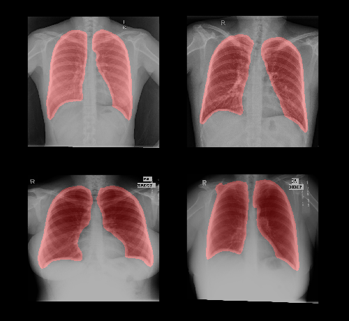

Welcome to Marcel and Weiling's openTMAS project progress page.

 [Marcel, the developer and designer](https://github.com/RBEGamer)  [Weiling, the data scientist](https://github.com/notagenius)

* * *

### Progress Map (May - June):

- Dataset Research
  - X-Ray
    - covid related ✔️ [Link to our report](./dataset-covid.html) (updated on 27 May 2020)
    - general conditions ✔️ (May 2020) [Link to our report](./dataset-general.html) (updated on 27 May 2020)
- Medical Learning Schedule 
  - radiopaedia 2020 4-day vitual conference (chest images on Day 2) [Link to conference schedule](https://radiopaedia.org/courses/radiopaedia-2020-virtual-conference#day2) (23 June)
  - read covid cases on Eurorad ✔️ [Link to cases](https://www.eurorad.org/advanced-search?search=COVID) (updated on 30 May 2020, all 22 items are read)
  - read covid case on Sirm [Link to cases](https://www.sirm.org/2020/05/31/covid-19-caso-115/) (in Italian, translator needed)
- Artificial Intelligence Study 
  - Lung Segmentation
    - Algorithms ✔️ [Link to our report](./segmentation.html) (updated on 02 June 2020)
    - Experiment Round 1 with implementing UNet ✔️ [Link to our code](https://github.com/notagenius/openTMAS/blob/master/segmentation/seg.py) (updated on 10 June 2020)
  - Lung Reconstruction
    - Algorithms
  - Lung Image Classification / Regression
    - Algorithms
- Web App
  - Frontend UI Design ✔️
  - Backend Endpoint Design

* * *

### Implementation Result

the visualization of predicted lung segmentation from deep learning based U-Net implementation.

* * *

This project is under the Supervision of Tim G.
 [Tim, our supervisor]

📧 marcel.ochsendorf@gmail.com

