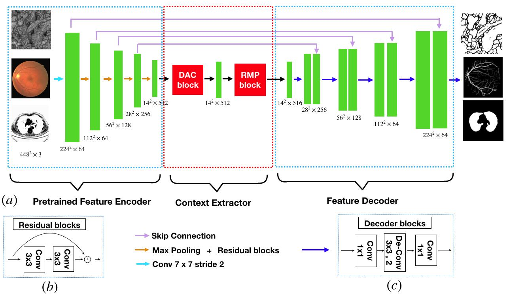
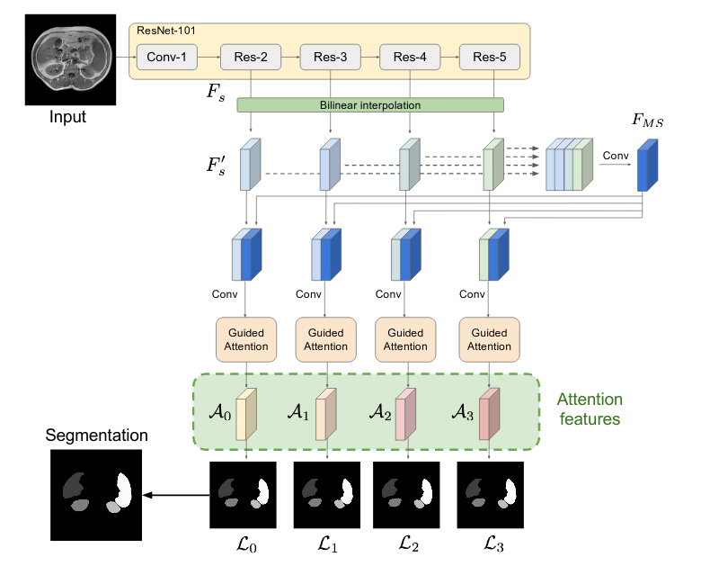
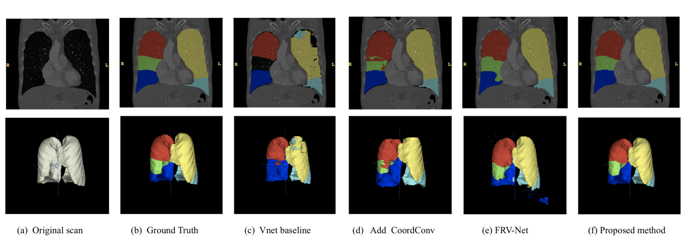
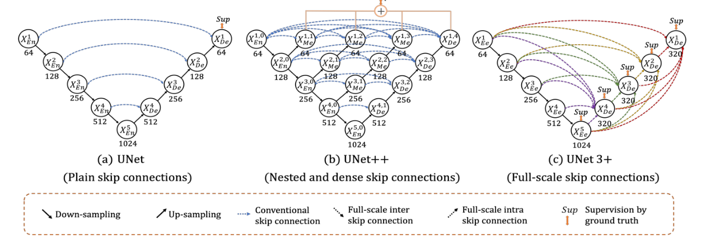

[back to main page](./)

## Lung segmentation algorithms

*   author: Marcel

*   updated on: 05 June 2020

### 1. U-Net: Convolutional Networks for Biomedical Image Segmentation [May 2015]

*   [Link to U-Net paper](https://github.com/notagenius/openTMAS/tree/master/docs/papers/Segmentation_UNet.pdf)

> note: accuracy hits 92% when metadata is combined (I-CNN + Weight + Age + Gender + Height)

### 2. UNet++: Redesigning Skip Connections to Exploit [Dec 2019]

*   [Link to UNet++ paper](https://github.com/notagenius/openTMAS/tree/master/docs/papers/Segmentation_UNetplusplus.pdf)

> note: the paper addressed multiscale features in image segmentation well. lung images segmentation is one of the applications in paper.

### 3. CE-Net: Context Encoder Network for 2D Medical Image Segmentation [March 2019]

*   [Link to CE-Net paper](https://github.com/notagenius/openTMAS/tree/master/docs/papers/Segmentation_CENet.pdf)

> note: Paper is released under the tasks of Electron Microscope Images.

### 4. HyperDense-Net: A hyper-densely connected CNN for multi-modal image segmentation [April 2018]

*   [Link to Hyper-Dense-Net paper](https://github.com/notagenius/openTMAS/tree/master/docs/papers/Segmentation_HyperDenseNet.pdf)

> note: state-of-the-art segmentation algorithms of Brain MRI images

### 5. Multi-scale self-guided attention for medical image segmentation [June 2019]

*   [Link to MS-Dual paper](https://github.com/notagenius/openTMAS/tree/master/docs/papers/Segmentation_MsDual.pdf)

> note: state-of-the-art on Abdominal CT and MRI segmetation.

### 6. V-Net: Fully Convolutional Neural Networks for Volumetric Medical Image Segmentation [June 2016]

*   [Link to V-Net paper](https://github.com/notagenius/openTMAS/tree/master/docs/papers/Segmentation_VNet.pdf)

> note:one of the application is on 343 chest CT scans and vnet was took as baseline as following figure

### 7. UNet 3+: A full-scale connected unet for medical image segmentation [Apr 2020]

*   [Link to UNet3+ paper](https://github.com/notagenius/openTMAS/tree/master/docs/papers/Segmentation_UNet3plus.pdf)

> note: using skip connection improvement over Unet++

[back to main page](./)
